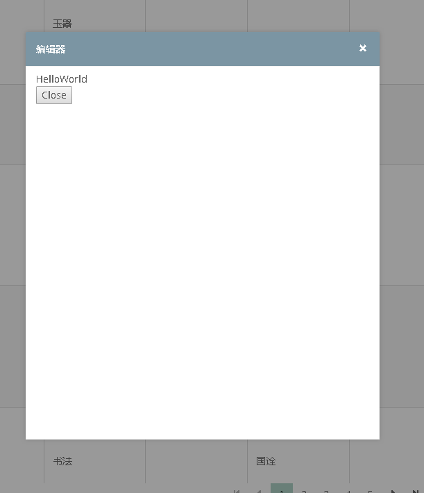

# 模态弹出窗体

使用PrimeNg的 dialog 组件可以轻松做出模态窗体
首先使用之前导入相关module,注意，这里由于弹出窗体具有动画效果，BrowserAnimationsModule也是必须导入的！

```typescript
import { DialogModule } from 'primeng/dialog';
import { BrowserAnimationsModule } from '@angular/platform-browser/animations';
  imports: [
    ......
    DialogModule,
    BrowserAnimationsModule
  ],

```

弹出窗体的HTML如下所示

```html
<p-dialog header="编辑器" [(visible)]="display" modal="modal" [responsive]="true">
    <div style="height: 520px;width:480px">
        HelloWorld <br />
        <input type="button" value="Close" (click)="CloseMe()" >
    </div>
</p-dialog>

```

后台代码如下所示

```typescript
import { Component, Output, EventEmitter } from '@angular/core';
import { ITreasure } from '../interface/ITreasure';

@Component({
  selector:"TreasureEdit",
  templateUrl: 'TreasureEdit.component.html'
})
export class TreasureEditComponent {
  constructor() {

  }
  @Output() pick: EventEmitter<any> = new EventEmitter();
  public display = false;
  treasure: ITreasure;

  CloseMe(){
    this.pick.emit(this.treasure);
    this.display = false;
  }
}
```

由于使用了PrimeNg组件，请一定要加上PrimeNg的CSS文件到Angular.json

```json
            "styles": [
              "./node_modules/primeng/resources/primeng.min.css",
              "./node_modules/primeng/resources/themes/rhea/theme.css",

```

注意事项：窗体里面的HTML请严格关闭TAG，不然可能出现奇怪的现象。

效果图：


